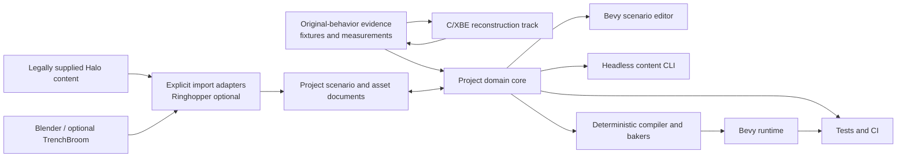
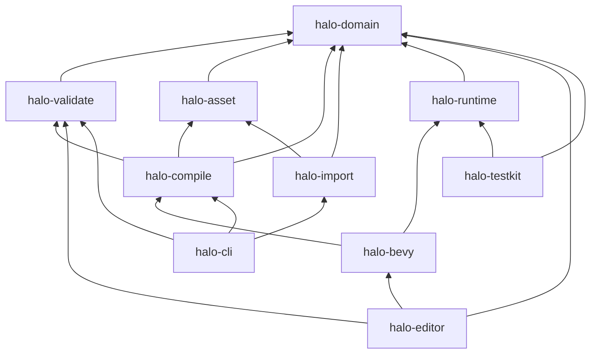
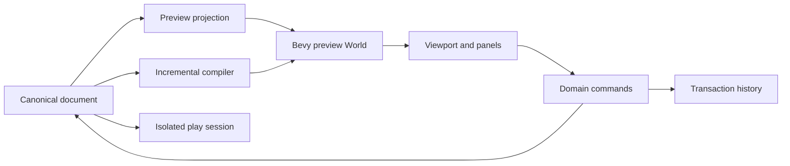
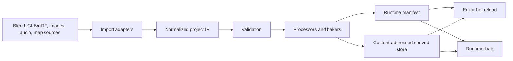

# Modern runtime and content-tooling architecture

## Status and scope

This document defines the intended architecture for a **parallel modern runtime and artist-facing content toolchain** built with Bevy and Rust. It does not replace the repository's existing C/XBE reconstruction path.

The two tracks answer different questions:

- **Reconstruction track:** what did the original Xbox executable do, and can verified pieces be reimplemented and patched back into it?
- **Modern track:** how can the verified behavior and legally supplied content be represented, edited, tested, and run on modern systems?

They share evidence, terminology, behavioral fixtures, and interoperability adapters. They do not share a build graph, and neither track is allowed to silently redefine the other's evidence.

The ecosystem evidence behind these choices is recorded in [`../research/bevy-ecosystem-2026-08.md`](../research/bevy-ecosystem-2026-08.md).

## Architectural principles

### 1. Behavior is the compatibility target

The modern runtime is not source-compatible with the original executable. It aims for observable behavioral compatibility backed by evidence:

- movement and collision traces;
- game-state transitions;
- tag and scenario semantics;
- timing and numerical fixtures;
- rendering and audio reference captures where lawful;
- map and asset conversion round trips.

When Bevy defaults differ from observed Halo behavior, project-owned compatibility systems win.

The first legacy environment reference is the Tutorial level distributed with the original Gearbox Halo Editing Kit. Operator-supplied `tutorial.scenario` source content and any compiled `tutorial.map` provide complementary authoring and cache evidence; public tests use a separately authored redistributable analogue.

### 2. Authoring data is not the Bevy world

The Bevy `World` is runtime state, not the canonical document. Canonical scenario and asset metadata live in versioned project documents with stable IDs. Editors project documents into a preview world; runtime compilers produce optimized artifacts from those same documents.

This avoids coupling authored content to:

- transient ECS entity IDs;
- one UI toolkit;
- one Bevy scene serialization generation;
- Blender object names;
- a particular physics or networking plugin.

### 3. One domain core, many surfaces

GUI editor, CLI, CI, tests, and Omegon integrations call the same domain operations. A command such as “place object,” “change encounter,” “validate scenario,” or “compile map” must not have separate business logic per frontend.

### 4. Source and derived assets are separate

Artist-authored sources remain source. Runtime meshes, colliders, navigation tiles, lightmaps, compressed audio, manifests, and packed levels are reproducible derived artifacts. Derived outputs carry processor/configuration versions, dependency hashes, source identities, and diagnostics.

### 5. Legacy interoperability is an adapter

Ringhopper and other GPL or legacy-oriented tools remain optional, explicit adapters. The modern runtime and editor core do not require Ringhopper to start, edit native documents, or run native content.

### 6. Artist workflows are first-class deliverables

A runtime capability is not complete if ordinary content creation still requires editing Rust. Every gameplay/content milestone identifies its authoring, validation, preview, and build affordances.

## System context



The arrows from the reconstruction track return **evidence**, not linked implementation code. This keeps clean ownership and makes compatibility claims testable.

## Proposed workspace topology

The modern track should enter as a Rust workspace under `modern/` only after the foundation spike passes. The intended shape is:

```text
modern/
├── Cargo.toml
├── crates/
│   ├── halo-domain/          # versioned documents, IDs, references, commands
│   ├── halo-validate/        # diagnostics and content rules
│   ├── halo-asset/           # source descriptors, provenance, dependency graph
│   ├── halo-compile/         # deterministic project IR -> runtime artifacts
│   ├── halo-import/          # glTF/Blender and optional format adapters
│   ├── halo-runtime/         # Bevy-independent gameplay rules where practical
│   ├── halo-bevy/            # Bevy ECS/render/physics integration
│   ├── halo-editor/          # Bevy editor application and UI projections
│   ├── halo-cli/             # import, validate, compile, inspect commands
│   └── halo-testkit/         # fixtures, traces, golden comparisons
├── assets/
│   ├── source/               # redistributable project-authored source assets
│   ├── scenarios/            # canonical project documents
│   └── fixtures/             # small legal test fixtures
└── examples/
```

This is a target dependency structure, not permission to create empty crates preemptively.

### Dependency direction



Rules:

- `halo-domain` does not depend on Bevy, egui, Blender tooling, Ringhopper, or a physics backend.
- `halo-runtime` keeps simulation rules Bevy-independent when doing so produces clearer tests; it does not imitate an ECS internally merely to avoid Bevy.
- `halo-bevy` owns ECS projections, Bevy assets, rendering, input integration, and selected plugin adapters.
- `halo-editor` owns presentation and editor interaction, not document mutation rules.
- `halo-cli` is a frontend over libraries, not a second compiler.

## Canonical content model

### Documents

The minimum native document set is:

- `ProjectManifest`: schema versions, roots, profiles, package identity, units, coordinate conventions;
- `ScenarioDocument`: world references, object placements, palettes, spawn data, triggers, devices, encounters, AI orders, netgame metadata;
- `PrefabDocument`: reusable authored entity composition with stable parameters and references;
- `AssetDescriptor`: source file, import recipe, semantic class, provenance, licenses, dependencies;
- `BuildProfile`: target platform/runtime options and processor settings.

Use a human-readable deterministic serialization during development. The format choice—RON, JSON, or another serde-backed representation—requires a fixture spike. The properties matter more than syntax:

- explicit `schema_version`;
- stable UUID-like IDs independent of array position and names;
- deterministic ordering/formatting;
- unknown-field and migration policy;
- source spans for diagnostics where feasible;
- atomic save and crash recovery;
- merge-conflict behavior tested with real edits.

### References

References use typed stable IDs plus optional human-readable paths. Runtime handles and ECS entities are resolved projections, never persisted identities.

An unresolved reference is a diagnostic, not a panic. Renames preserve identity. Deletion either refuses while referenced or produces an explicit repair command.

### Commands and undo/redo

All edits are domain commands:

```text
PlaceObject
MoveObject
ChangeProperty
CreateTriggerVolume
AssignEncounterSquad
RewireDevice
DeleteObject
```

A command validates preconditions and yields an inverse or document delta. The editor records command transactions for undo/redo. CLI automation and tests can apply the same commands. Direct arbitrary mutation of canonical documents from UI systems is prohibited.

The first implementation may use snapshot-backed undo for simplicity, provided the public command boundary remains stable. Optimize deltas only after profiling.

## Editor architecture

The editor is a specialized authoring application analogous in **affordance**, not design, to a world/scenario editor and structured asset editor.

### Required early workspaces

1. **Scenario workspace**
   - viewport and editor camera;
   - hierarchy/outliner;
   - object/prefab palette;
   - selection and transform gizmo;
   - schema-driven inspector;
   - trigger and volume overlays;
   - validation panel;
   - save/reload and dirty state;
   - play-in-editor.
2. **Asset workspace**
   - asset browser and dependency view;
   - import status and diagnostics;
   - structured metadata inspector;
   - reimport command;
   - source/provenance display.
3. **Diagnostics workspace**
   - collision, navigation, spawn, encounter, and reference overlays;
   - compiler logs linked to document objects;
   - performance/debug metrics.

Complex asset classes later receive dedicated editors. Reflection-generated property grids are a baseline, not a mandate to force every workflow into a generic inspector.

### Editor state separation



Editor-only state—selection, camera, open panels, temporary gizmo drag, filters—is stored separately from project content. Play-in-editor runs against a compiled snapshot or isolated world so gameplay cannot silently mutate the authored document.

### UI strategy

For the first shell, `bevy-inspector-egui`/egui may accelerate hierarchy and inspector prototypes. The domain command layer and view models must not expose egui types. Bevy UI/Feathers and Jackdaw patterns remain migration/evaluation targets.

## Asset and build pipeline



### Pipeline properties

- deterministic for identical source bytes, configuration, and processor versions;
- incremental via explicit dependency graph and content hashes;
- headless and CI-runnable;
- cancellation-safe and atomic at artifact boundaries;
- diagnostics include source, object identity, processor, and suggested repair;
- no GUI-only conversion step;
- hot reload invalidates only affected projections where possible.

Bevy's asset processor is the initial execution substrate to evaluate, not the canonical graph schema. Project provenance and dependency metadata remain project-owned so a Bevy migration does not erase build history.

### Blender boundary

Blender is authoritative for art-centric source data. The project owns export profiles and semantic conventions:

- coordinate system and scale;
- naming only for readability, never identity alone;
- collision proxy markers;
- sockets/markers;
- material semantic slots;
- LOD and lightmap metadata;
- stable exported identities;
- deterministic/headless export.

Plain glTF extras, Skein, and Blenvy are compared in a spike before adoption. Gameplay-rich scenario data remains in project documents even if Blender can display or round-trip selected components.

### Optional TrenchBroom boundary

If the spike succeeds, `.map` is a greybox source imported into normalized geometry and entity metadata. The importer must preserve source mapping for reimport diagnostics. Runtime code never loads TrenchBroom documents directly.

## Runtime architecture

### Fixed simulation boundary

Gameplay simulation uses an explicit fixed-rate schedule. Rendering, editor UI, and asynchronous asset work cannot alter simulation cadence. The exact tick rate is an evidence-backed compatibility parameter, not a Bevy default.

Inputs become semantic actions before entering simulation. Simulation emits state and presentation events. Rendering interpolates presentation without mutating authoritative simulation state.

### Gameplay ownership

Project-owned systems include:

- player movement and camera feel;
- damage, shields, health, and death;
- weapons, projectiles, melee, grenades, and inventory;
- object/device state machines;
- encounter, AI order, and spawning semantics;
- vehicle entry/exit and control;
- game rules and scoring;
- save/checkpoint semantics;
- deterministic/random-stream policy;
- future authority and replication classification.

Bevy plugins may provide physics, input collection, rendering, audio, navigation, and transport. They do not define compatibility semantics.

### Physics abstraction

Do not build an elaborate universal physics abstraction. Define the narrow project boundary needed by gameplay tests:

- character sweep/slide/step queries;
- ray/shape casts;
- trigger/contact events;
- dynamic body impulses;
- collision layers and material response;
- debug geometry extraction.

Run the same test course against Avian and Rapier before selecting one. Once selected, allow direct backend use inside `halo-bevy` where wrapping adds no compatibility value.

### Networking boundary

Networking is deferred, but simulation components must classify:

- authoritative state;
- predicted state;
- presentation-only state;
- stable network identity;
- deterministic inputs and events.

Do not serialize arbitrary ECS worlds. A later Lightyear spike must demonstrate prediction, reconciliation, visibility, hierarchy, and dedicated-server behavior using a small gameplay slice.

## Reference environment: HEK tutorial level

The first environment/scenario compatibility target is the tutorial level distributed with Gearbox's Halo Editing Kit. Public HEK descriptions identify it as the companion to the official step-by-step multiplayer level-building tutorial. Its compact, pedagogical design makes it a better target than an arbitrary retail map for proving an end-to-end world/content workflow.

This choice does not alter the native architecture:

- local HEK files are operator-supplied reference inputs;
- Ringhopper or other legacy tools are explicit adapters;
- imported information enters the normalized project IR;
- native documents remain editor/runtime authority;
- proprietary files and unclear-rights derivatives are not committed;
- a project-authored redistributable analogue carries public CI and sample workflows.

The tutorial level should drive an affordance matrix spanning source evidence, import, native representation, editor manipulation, compilation, runtime behavior, and validation. Inspection—not recollection—determines the actual feature inventory and filenames.

Evidence:

- [HaloMaps HEK distribution record](https://halomaps.org/hce/detail.cfm?fid=411)
- [Halo Custom Edition and HEK overview](https://c20.reclaimers.net/h1/custom-edition)
- [Tutorial map overview](https://www.halopedia.org/Tutorial_(Halo:_Combat_Evolved))

## Interoperability and licensing boundaries

### Ringhopper

Ringhopper is GPL-3.0-only. Directly linked integrations belong in separately distributed GPL-compatible tools such as the independent `omegon-ringhopper` checkout. The permissive modern core should communicate through files or documented process protocols only after license review.

Expected uses:

- inspect legally supplied maps/tags;
- extract normalized metadata for research fixtures;
- compare our parser/compiler behavior;
- support explicit, provenance-aware import operations.

Ringhopper is not a runtime dependency and is not silently invoked by ordinary builds.

### Invader

[Invader](https://github.com/SnowyMouse/invader) is a GPL-3.0-only legacy content toolchain with broad tag, cache-build, extraction, comparison, script, bitmap, sound, model, resource-map, editing, and repair capabilities. It complements rather than replaces Ringhopper: Ringhopper remains the typed read-only inspection service, while pinned Invader executables may support explicit operator-invoked build and transformation experiments.

Invader is not linked into the permissive modern core, does not define canonical documents, and is not invoked by ordinary editor/runtime builds. Any automation uses a narrow process contract with pinned revision/hash, constrained roots, staged outputs, timeouts, captured diagnostics, and provenance. See the [Invader assessment](../research/invader-assessment-2026-08.md).

### Original content

No original executables or proprietary game assets enter version control. Tests use project-authored, redistributable fixtures unless an operator explicitly supplies local content. Local-only inputs and outputs remain ignored and provenance-recorded.

## Testing strategy

### Test layers

1. **Domain tests:** document parsing, migrations, references, commands, undo/redo, validation.
2. **Compiler tests:** deterministic artifact hashes, dependency invalidation, diagnostics, round trips.
3. **Simulation tests:** fixed-step traces and state transitions without rendering.
4. **Backend conformance tests:** physics and asset adapters against shared fixtures.
5. **Editor tests:** command/view-model behavior headlessly; a small set of interaction smoke tests.
6. **Golden visual/audio tests:** only where stable tolerances and lawful references exist.
7. **Compatibility tests:** observed original behavior encoded with provenance and uncertainty.

Every compatibility assertion records whether it is observed, inferred, or a temporary design choice.

### Performance budgets

Budgets are specified per representative scene and hardware class, not as vague “fast” goals. Track:

- fixed simulation step time;
- render CPU/GPU frame time;
- editor interaction latency;
- import and incremental rebuild time;
- artifact size and runtime memory;
- startup and play-in-editor transition time.

## Decision gates

A dependency graduates from spike to default only when its design record includes:

- exact version/revision and license;
- maintenance/activity evidence;
- transitive dependency and platform impact;
- project fixture results;
- failure and migration strategy;
- owner and reevaluation trigger.

Initial gates:

- Bevy 0.19 foundation;
- plain glTF vs Skein vs Blenvy;
- RON vs JSON (or another serde format) for canonical documents;
- egui prototype shell viability;
- Avian vs Rapier;
- optional TrenchBroom import;
- navigation approach;
- later Lightyear networking viability.

## Explicit non-goals for the foundation

- replacing or deleting the C/XBE reconstruction;
- cloning the appearance or implementation of proprietary Halo tools;
- implementing a general-purpose DCC package;
- complete terrain sculpting, VFX graphs, animation graphs, or shader graphs;
- selecting multiplayer architecture before a tested simulation slice;
- bulk importing proprietary content;
- designing all future crates before one vertical slice works.
