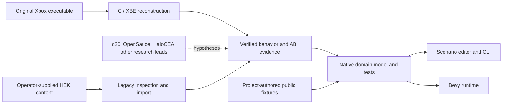
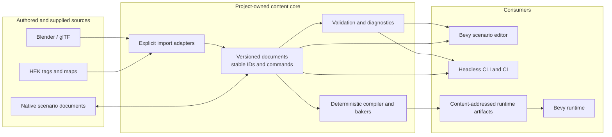
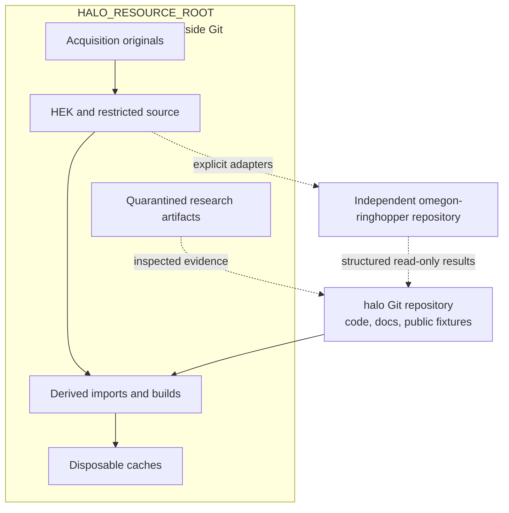
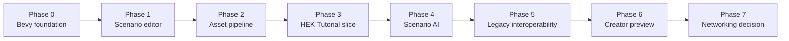
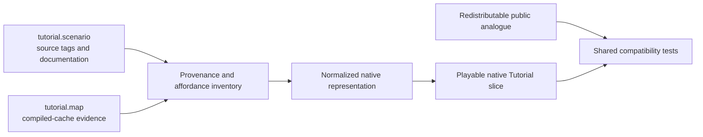
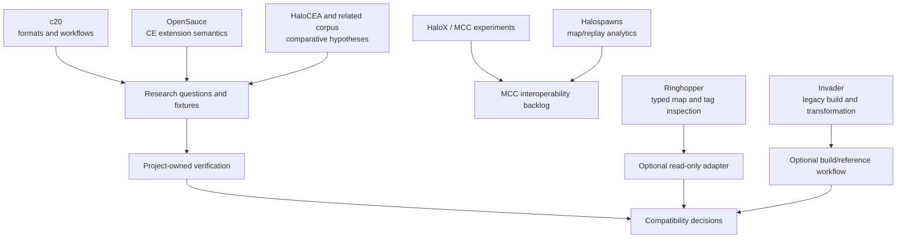

# Halo reconstruction and modern-tooling ecosystem

This is a compact visual index of the plans in:

- [`architecture/modern-runtime-toolchain.md`](architecture/modern-runtime-toolchain.md)
- [`modern-runtime-roadmap.md`](modern-runtime-roadmap.md)
- [`research/discord-reference-assessment-2026-08.md`](research/discord-reference-assessment-2026-08.md)

The diagrams deliberately show ownership and handoff boundaries rather than every crate, tag group, or community project.

## 1. Project tracks and evidence flow

Key boundary: community corpora can generate hypotheses; only verified observations become compatibility evidence. The modern runtime consumes evidence, not reconstruction source code.

## 2. Content and build flow

Source assets and canonical documents are preserved. Generated meshes, colliders, lightmaps, navigation, and packages are derived outputs—not authoring truth.

## 3. Local storage and repository boundaries

Large or restricted resources live under `~/.local/share/halo-re`. There is no repository symlink and the Ringhopper extension remains a separate checkout rather than a submodule.

## 4. Planned delivery ladder

Each transition is evidence-gated. A later phase does not authorize speculative scaffolding in an earlier one.

## 5. HEK Tutorial compatibility ladder

The operator-supplied Tutorial artifacts stay outside Git. The public analogue exercises the same native import-independent runtime paths in CI.

## 6. External ecosystem posture

External projects are not a universal dependency graph. They occupy bounded roles:

- **c20:** terminology, format, and workflow index;
- **OpenSauce:** historical Custom Edition extension semantics;
- **HaloCEA/corpora:** version-labeled hypotheses requiring independent verification;
- **HaloX:** future MCC module-hosting research;
- **Halospawns:** map catalog, replay, heatmap, region, and analytics concepts;
- **Ringhopper:** explicit structured inspection at a separate GPL process/repository boundary;
- **Invader:** optional pinned legacy tag/cache build, extraction, comparison, and transformation reference, also behind a GPL process boundary. See the [dated assessment](research/invader-assessment-2026-08.md).

## Halospawns relevance

Authenticated inspection of the shared development site showed a Svelte application backed by a separate API. The frontend exposes concepts including:

- map catalog, releases, variants, families, and similarity suggestions;
- GLB/JSON map assets and generated thumbnails;
- replay-to-map matching;
- player and game statistics;
- positional heatmaps;
- named map regions, region sets, transforms between related maps, and region statistics;
- map reprocessing and screenshot regeneration workflows.

This is useful as evidence for **analytics and map-coordinate tooling**, not as a core runtime dependency. The strongest ideas to carry forward are:

1. explicit map release/build/family identity;
2. coordinate-space metadata and transforms between related map versions;
3. authored named regions layered over map geometry;
4. derived heatmaps and replay observations kept separate from canonical level content;
5. reproducible map-processing and screenshot jobs.

The Basic-auth credential gates the website only. The API uses a separate authentication system, so the shared credential did not authorize API data access. No API payloads or proprietary map assets were downloaded.
