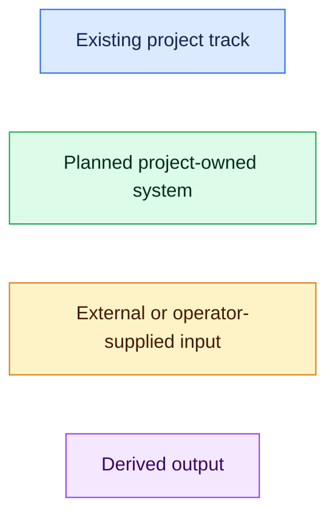
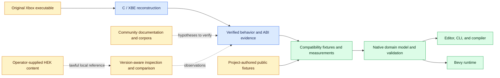
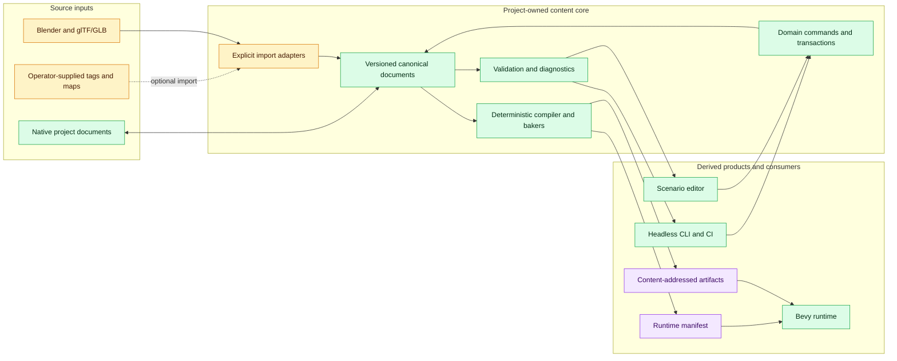
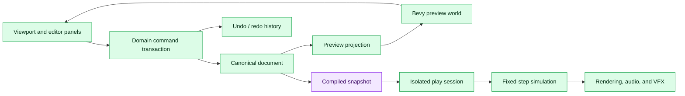
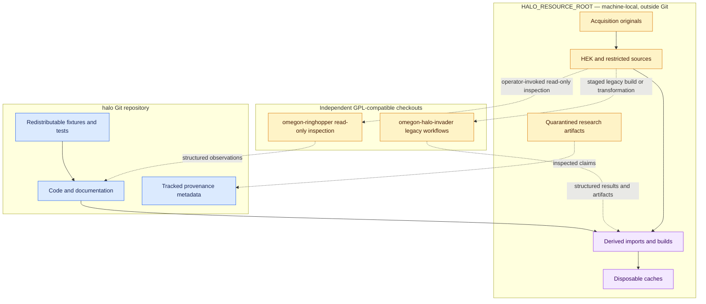
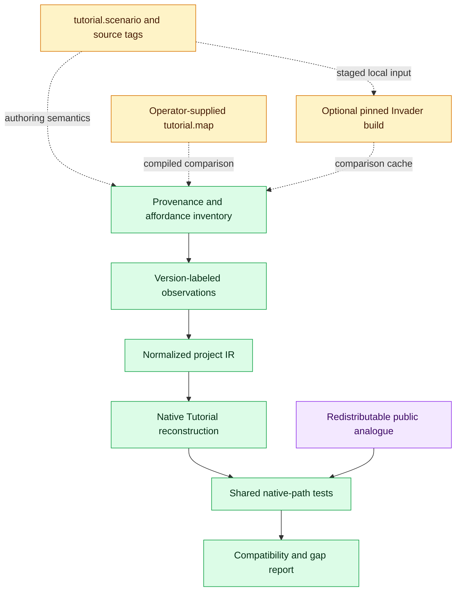
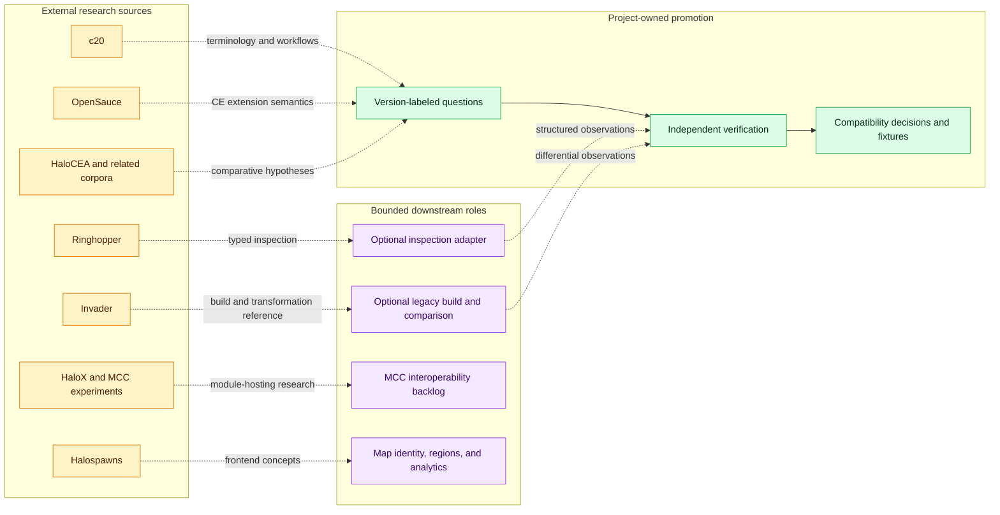

# Halo reconstruction and modern-tooling ecosystem

This document is the visual map of Halo's two project tracks, their evidence
boundaries, and the planned modern content pipeline. It summarizes—not
supersedes—the authoritative architecture, roadmap, and research records:

- [`architecture/modern-runtime-toolchain.md`](architecture/modern-runtime-toolchain.md)
  defines the modern architecture and ownership boundaries.
- [`modern-runtime-roadmap.md`](modern-runtime-roadmap.md) defines evidence-gated
  delivery phases.
- [`research/bevy-ecosystem-2026-08.md`](research/bevy-ecosystem-2026-08.md)
  records current Bevy ecosystem evidence and candidate dependencies.
- [`research/discord-reference-assessment-2026-08.md`](research/discord-reference-assessment-2026-08.md)
  assesses external Halo research leads and their evidentiary limits.
- [`research/invader-assessment-2026-08.md`](research/invader-assessment-2026-08.md)
  defines Invader's optional legacy build and differential-reference role.

The C/XBE reconstruction is an existing implementation track. The modern
runtime and toolchain are a planned parallel track whose first three spikes are
tracked in [`modern-runtime-foundation.md`](modern-runtime-foundation.md),
[`native-scenario-editor.md`](native-scenario-editor.md), and
[`deterministic-asset-pipeline.md`](deterministic-asset-pipeline.md).

## How to read the diagrams

Across the diagrams, line style carries meaning:

- **solid arrows** show a project-owned data or control flow;
- **dashed arrows** show research, evidence, or optional adapter input;
- **double-headed arrows** show an intentional edit/projection relationship,
  not shared ownership.

Node color identifies the governing boundary rather than implementation status:

The colors are only an aid; every boundary is also stated in text and encoded
by labels or line style.

## 1. Parallel tracks and evidence promotion

The tracks share evidence, terminology, and behavioral fixtures—not a build
graph. Community sources can propose names, layouts, or behavior, but a claim
becomes compatibility evidence only after project-owned verification. The
modern track consumes that promoted evidence; it does not treat reconstructed
or third-party source as canonical implementation.

Every compatibility record must identify the relevant engine, platform, and
build. “Halo 1” alone is not precise enough to distinguish original Xbox,
Gearbox PC/Custom Edition, OpenSauce, HCEA, or MCC/H1A behavior.

## 2. Authoring, compilation, and runtime flow

The canonical documents are versioned project data with stable typed IDs; they
are not serialized Bevy worlds. UI systems do not mutate those documents
directly. GUI and CLI actions cross the same command, validation, and compiler
boundaries, including undoable editor transactions.

Artist-authored sources remain sources. Imported intermediate data, optimized
meshes, colliders, navigation, lightmaps, compressed media, manifests, and
packages are reproducible derived outputs carrying source and dependency
hashes, processor/configuration versions, provenance, and diagnostics.

## 3. Editor, play mode, and runtime ownership

Selection, cameras, open panels, filters, and in-progress gizmo drags are
editor state, not authored content. Play mode runs from an isolated snapshot so
gameplay cannot silently alter the document or transaction history.

The runtime uses an explicit fixed simulation schedule. Rendering and
asynchronous asset work cannot define authoritative cadence. Physics,
navigation, audio, VFX, and future networking plugins provide mechanisms;
project-owned systems define compatibility behavior.

## 4. Repository, licensing, and local-resource boundaries

The default local resource root is `~/.local/share/halo-re`. Original
executables, HEK files, maps, tags, unclear-rights derivatives, and proprietary
media never enter this repository. There is no repository symlink to the local
resource tree.

Ringhopper and Invader are GPL-3.0-only. Their integrations therefore remain
independent, ignored checkouts rather than submodules or silently linked
permissive-core dependencies. Ringhopper provides the default structured,
read-only inspection boundary. Invader occupies a separate, optional legacy
build, extraction, comparison, and transformation role whose mutating
operations require staged outputs and explicit operator invocation. The native
editor and runtime must operate without either tool.

## 5. Evidence-gated delivery ladder

```mermaid
flowchart LR
    P0[Phase 0<br/>foundation spike]
    P1[Phase 1<br/>native scenario editor]
    P2[Phase 2<br/>deterministic asset pipeline]
    P3[Phase 3<br/>Tutorial compatibility slice]
    P4[Phase 4<br/>scenario systems and AI]
    P5[Phase 5<br/>legacy interoperability]
    P6[Phase 6<br/>creator preview]
    P7[Phase 7<br/>networking decision]

    P0 -->|exit evidence| P1
    P1 -->|exit evidence| P2
    P2 -->|exit evidence| P3
    P3 -->|exit evidence| P4
    P4 -->|exit evidence| P5
    P5 -->|exit evidence| P6
    P6 -->|exit evidence| P7

    classDef active fill:#dbeafe,stroke:#2563eb,color:#172554
    classDef planned fill:#dcfce7,stroke:#16a34a,color:#052e16

    class P0 active
    class P1,P2,P3,P4,P5,P6,P7 planned
```

Phase 0 is an exploring design spike, not a completed runtime. Phases 1 and 2
have seed design records and depend on evidence from the preceding phase. Later
phases remain roadmap intent. A future phase does not authorize empty crates,
premature dependency selection, or speculative abstractions in an earlier one.

Each gate requires an inspectable artifact, measured project evidence, lawful
public fixtures, and explicit promotion decisions. Networking remains deferred
until the simulation and content model are stable enough to test.

## 6. HEK Tutorial compatibility path

The Gearbox HEK Tutorial is the first environment/scenario compatibility target.
Its source tags provide authoring semantics; a locally supplied or built map
provides complementary compiled-cache evidence. A pinned Invader experiment
may build a comparison cache, while Ringhopper and Invader provide differential
inspection evidence. None of those proprietary inputs or derived payloads is
committed or redistributed.

The inventory records each field as observed, derived, absent, unsupported, or
not yet inspected. The project-authored analogue contains no proprietary
payload, but it exercises the same normalized representation, compiler,
runtime, and validation paths in public CI. Success is measured by a capability
matrix—not by a vague “loads Tutorial” checkbox.

## 7. External ecosystem roles

These projects are not a dependency stack and do not have equal authority:

| Source | Bounded role | Evidentiary limit |
|---|---|---|
| c20 | Version-aware terminology, formats, and workflow index | Secondary documentation; verify compatibility-critical claims |
| OpenSauce | Historical Custom Edition extension semantics | Evidence for OpenSauce behavior, not stock Xbox or CE behavior |
| HaloCEA and related corpora | Names, subsystem boundaries, and comparative hypotheses | Different lineage and unclear licensing; never bulk-import source or claims |
| Ringhopper | Typed inspection of lawfully supplied maps and tags | Optional GPL-boundary adapter, never canonical runtime authority |
| Invader | Pinned legacy tag/cache build, extraction, comparison, and transformation reference | Optional GPL process with mutating tools; never a linked native compiler or unrestricted command surface |
| HaloX and related MCC work | Future module-hosting and launcher research | Not evidence of a complete Halo 1 standalone host |
| Halospawns | Map identity, coordinate transforms, named regions, replay/heatmap, and processing-job concepts | Frontend concepts only; not a core runtime dependency or gameplay authority |

Halospawns is most relevant to a future analytics/tooling layer: explicit map
release and family identity, transforms between related coordinate spaces,
named regions over geometry, derived replay observations and heatmaps, and
reproducible processing or screenshot jobs. Those derived observations remain
separate from canonical level content. The inspected website credential did
not grant API access, and no API payloads or proprietary map assets were
retrieved.

## Governing invariants

When this overview and a detailed record appear to differ, the detailed
architecture, roadmap, design record, or evidence assessment governs. The
cross-cutting rules are:

1. Promote observations, not third-party implementation, across the
   reconstruction/modern boundary.
2. Keep `halo-domain` and canonical documents independent of Bevy, UI,
   physics, networking, Blender add-ons, Ringhopper, and Invader.
3. Persist stable typed IDs, never ECS entity IDs.
4. Route every edit surface through shared commands, validation, and compiler
   libraries.
5. Keep authored source, canonical documents, and derived artifacts distinct.
6. Make derived builds deterministic where practical and provenance-complete.
7. Keep editor state, play state, and authored state isolated.
8. Give project-owned compatibility systems authority over plugin defaults.
9. Require lawful public fixtures for ordinary tests and CI.
10. Advance phases and dependencies only on recorded evidence.
